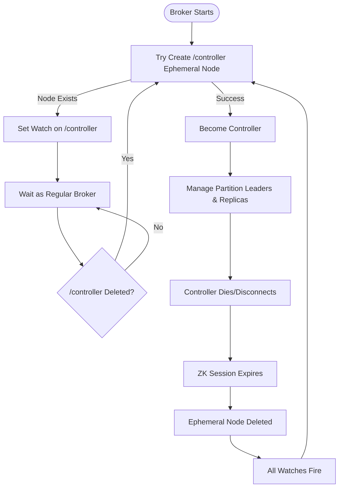
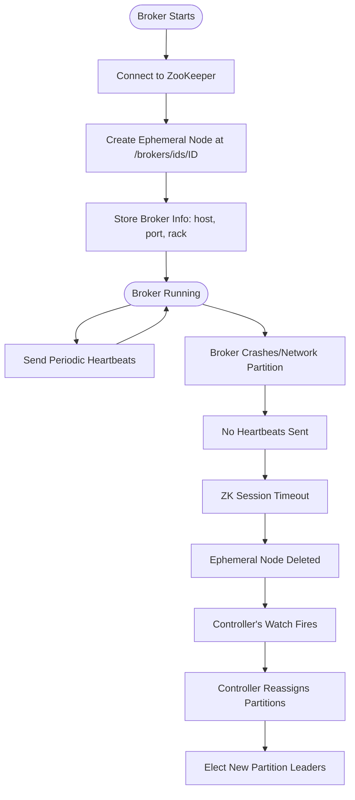
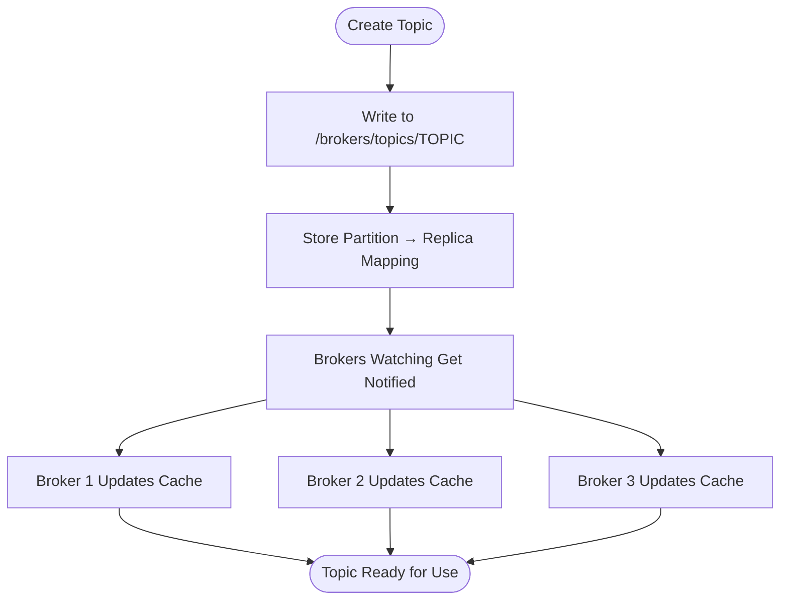
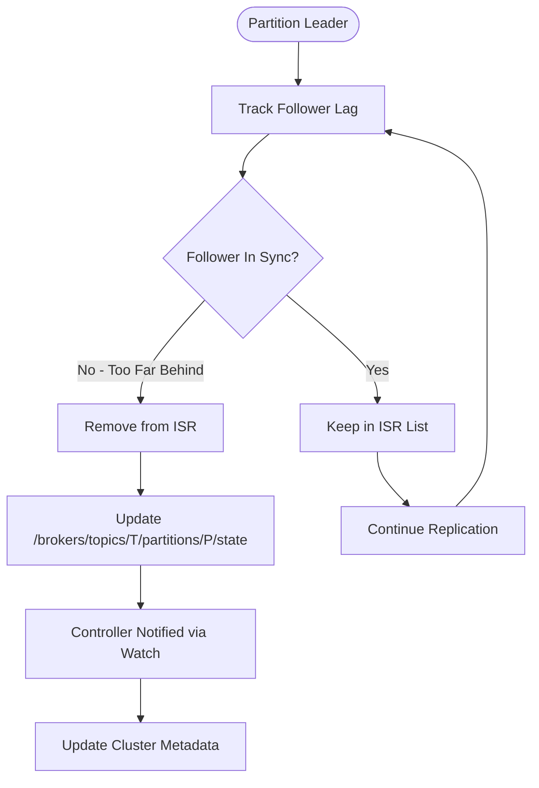
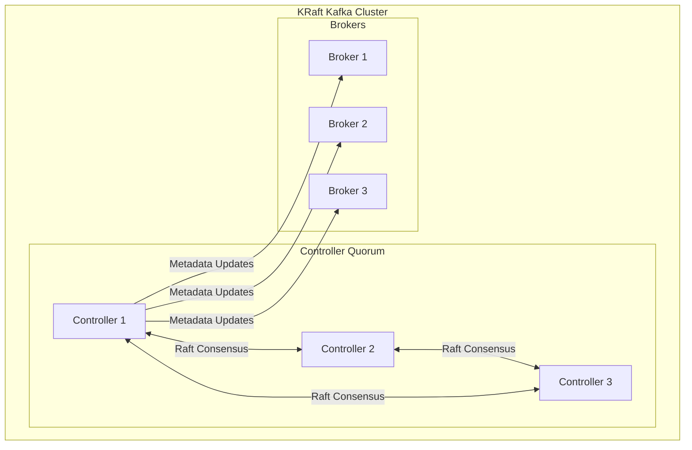
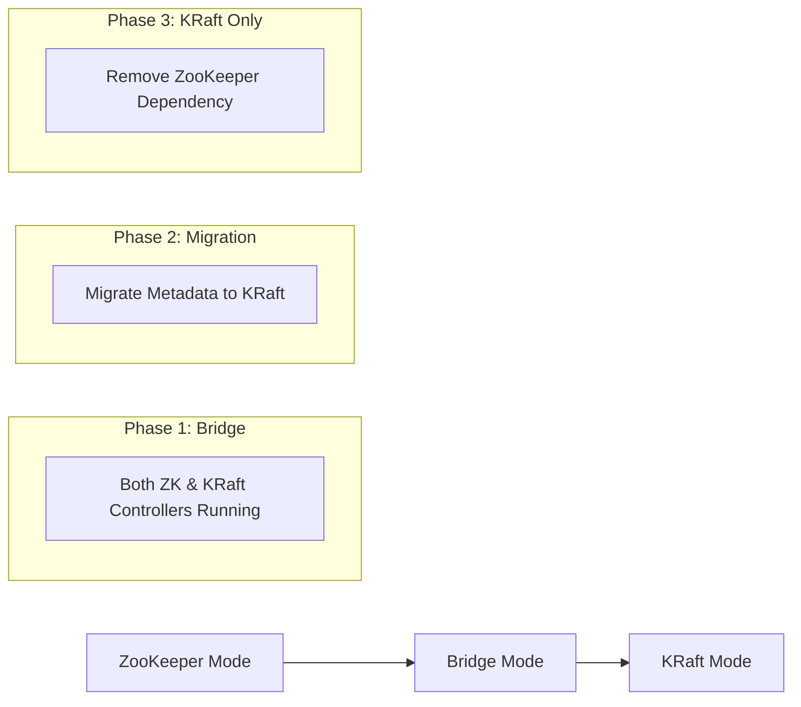

# Kafka and ZooKeeper Integration

This document explains how Apache Kafka uses ZooKeeper for coordination and metadata management.

## Does Kafka Start ZooKeeper?

**No, Kafka does not automatically start ZooKeeper.** They are independent processes that must be started separately:

```bash
# Step 1: Start ZooKeeper first
bin/zookeeper-server-start.sh config/zookeeper.properties

# Step 2: Then start Kafka broker
bin/kafka-server-start.sh config/server.properties
```

ZooKeeper must be running before any Kafka broker can start successfully.

---

## Architecture Overview

```
┌─────────────────────────────────────────────────────────────┐
│                     Kafka Cluster                            │
│  ┌─────────┐   ┌─────────┐   ┌─────────┐                   │
│  │ Broker 1│   │ Broker 2│   │ Broker 3│                   │
│  │(Control)│   │         │   │         │                   │
│  └────┬────┘   └────┬────┘   └────┬────┘                   │
│       │             │             │                         │
│       └─────────────┼─────────────┘                         │
│                     │                                       │
└─────────────────────┼───────────────────────────────────────┘
                      │ Ephemeral nodes + Watches
                      ▼
┌─────────────────────────────────────────────────────────────┐
│                   ZooKeeper Ensemble                         │
│  ┌─────────┐   ┌─────────┐   ┌─────────┐                   │
│  │   ZK 1  │   │   ZK 2  │   │   ZK 3  │                   │
│  │(Leader) │   │(Follower│   │(Follower│                   │
│  └─────────┘   └─────────┘   └─────────┘                   │
└─────────────────────────────────────────────────────────────┘
```

---

## What Kafka Stores in ZooKeeper

| Purpose | ZooKeeper Path | Description |
|---------|---------------|-------------|
| **Broker Registration** | `/brokers/ids/[broker_id]` | Ephemeral nodes - brokers register here on startup |
| **Topic Configuration** | `/brokers/topics/[topic]` | Partition assignments and replica info |
| **Controller Election** | `/controller` | Ephemeral node - one broker becomes controller |
| **Consumer Offsets** (legacy) | `/consumers/[group]/offsets` | Old consumer API stored offsets here |
| **ACLs** | `/kafka-acl` | Security access control lists |
| **ISR (In-Sync Replicas)** | `/brokers/topics/[topic]/partitions/[id]/state` | Which replicas are in sync |
| **Cluster ID** | `/cluster/id` | Unique identifier for the cluster |
| **Config Overrides** | `/config/[type]/[name]` | Dynamic configuration changes |

---

## Key Coordination Patterns

### 1. Controller Election

Only one Kafka broker acts as the **Controller** at any time. The controller is responsible for:
- Partition leader election
- Replica management
- Handling broker failures



### 2. Broker Registration & Failure Detection



### 3. Topic & Partition Metadata



### 4. ISR (In-Sync Replicas) Management



---

## ZooKeeper Node Structure for Kafka

```
/
├── brokers/
│   ├── ids/
│   │   ├── 0          (ephemeral) → {"host":"broker1","port":9092}
│   │   ├── 1          (ephemeral) → {"host":"broker2","port":9092}
│   │   └── 2          (ephemeral) → {"host":"broker3","port":9092}
│   ├── topics/
│   │   └── my-topic/
│   │       └── partitions/
│   │           ├── 0/state → {"leader":1,"isr":[1,2,0]}
│   │           ├── 1/state → {"leader":2,"isr":[2,0,1]}
│   │           └── 2/state → {"leader":0,"isr":[0,1,2]}
│   └── seqid
├── controller         (ephemeral) → {"brokerid":0}
├── controller_epoch   → 15
├── cluster/
│   └── id             → "abc123-cluster-uuid"
├── config/
│   ├── brokers/
│   ├── topics/
│   └── clients/
├── admin/
│   └── delete_topics/
└── kafka-acl/
```

---

## KRaft Mode (ZooKeeper-less Kafka)

Starting with **Kafka 2.8**, a new mode called **KRaft** (Kafka Raft) removes the ZooKeeper dependency entirely.

### Why KRaft?

| Aspect | With ZooKeeper | KRaft Mode |
|--------|---------------|------------|
| **Dependencies** | Separate ZK cluster required | Self-contained |
| **Scalability** | Limited by ZK (~200k partitions) | Millions of partitions |
| **Recovery Time** | Slower (ZK sync required) | Faster failover |
| **Operational Complexity** | Two systems to manage | Single system |
| **Metadata Storage** | ZooKeeper znodes | Internal `__cluster_metadata` topic |

### KRaft Architecture



### Starting Kafka in KRaft Mode

```bash
# Step 1: Generate a cluster ID
KAFKA_CLUSTER_ID="$(bin/kafka-storage.sh random-uuid)"

# Step 2: Format the storage directories
bin/kafka-storage.sh format -t $KAFKA_CLUSTER_ID -c config/kraft/server.properties

# Step 3: Start Kafka (no ZooKeeper needed!)
bin/kafka-server-start.sh config/kraft/server.properties
```

### KRaft Configuration Example

```properties
# config/kraft/server.properties

# Role: controller, broker, or both
process.roles=broker,controller

# Node ID (must be unique)
node.id=1

# Controller quorum voters
controller.quorum.voters=1@localhost:9093,2@localhost:9094,3@localhost:9095

# Listeners
listeners=PLAINTEXT://:9092,CONTROLLER://:9093
controller.listener.names=CONTROLLER

# Log directories
log.dirs=/var/kafka-logs
```

---

## Migration Path: ZooKeeper to KRaft



---

## Comparison Summary

| Feature | ZooKeeper Mode | KRaft Mode |
|---------|---------------|------------|
| **ZooKeeper Required** | Yes (separate process) | No |
| **Production Ready** | Yes (traditional) | Yes (Kafka 3.3+) |
| **Controller Election** | ZooKeeper ephemeral nodes | Raft consensus |
| **Metadata Storage** | ZooKeeper znodes | Internal Kafka topic |
| **Max Partitions** | ~200,000 | Millions |
| **Failover Speed** | Seconds to minutes | Sub-second |
| **Recommended For** | Legacy deployments | New deployments |

---

## Quick Reference Commands

### ZooKeeper Mode
```bash
# Start ZooKeeper
bin/zookeeper-server-start.sh config/zookeeper.properties

# Start Kafka
bin/kafka-server-start.sh config/server.properties

# Check ZooKeeper nodes (using ZK CLI)
bin/zookeeper-shell.sh localhost:2181
ls /brokers/ids
get /controller
```

### KRaft Mode
```bash
# Format and start
bin/kafka-storage.sh format -t $(bin/kafka-storage.sh random-uuid) -c config/kraft/server.properties
bin/kafka-server-start.sh config/kraft/server.properties

# Check cluster metadata
bin/kafka-metadata.sh --snapshot /var/kafka-logs/__cluster_metadata-0/00000000000000000000.log --command "cat"
```

---

## Related Documentation

- [ZooKeeper Coordination Flowcharts](./ZOOKEEPER_FLOWCHARTS.md) - Detailed ZooKeeper internals
- [Apache Kafka Documentation](https://kafka.apache.org/documentation/)
- [KRaft Migration Guide](https://kafka.apache.org/documentation/#kraft)
