# ZooKeeper Coordination Flowcharts

This document contains detailed flowcharts for understanding ZooKeeper's coordination mechanisms.

## 1. Client Connection and Session Establishment

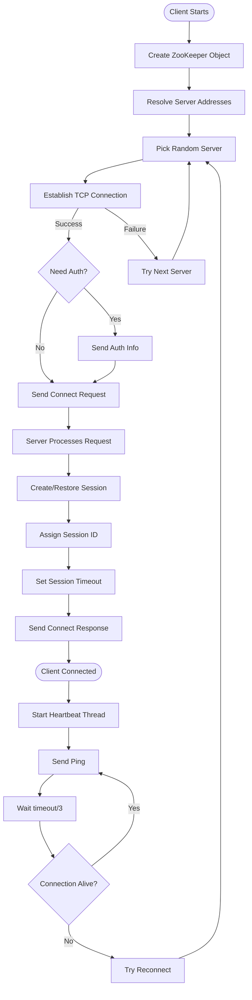

## 2. Write Operation Flow (Create Node Example)

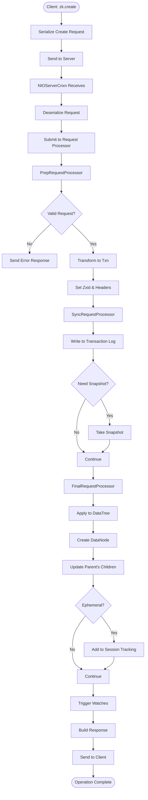

## 3. Leader Election Process

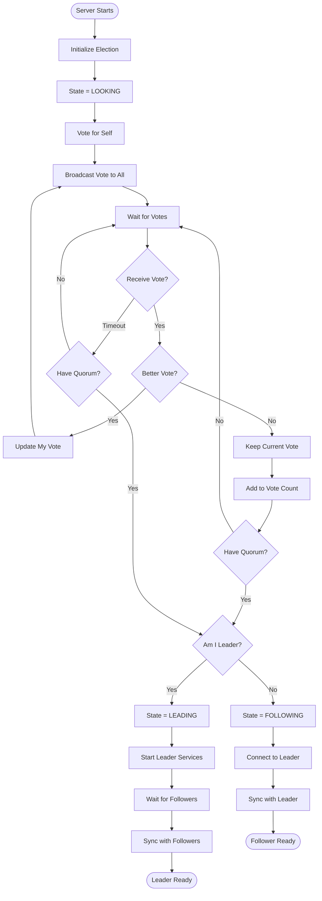

### Vote Comparison Logic

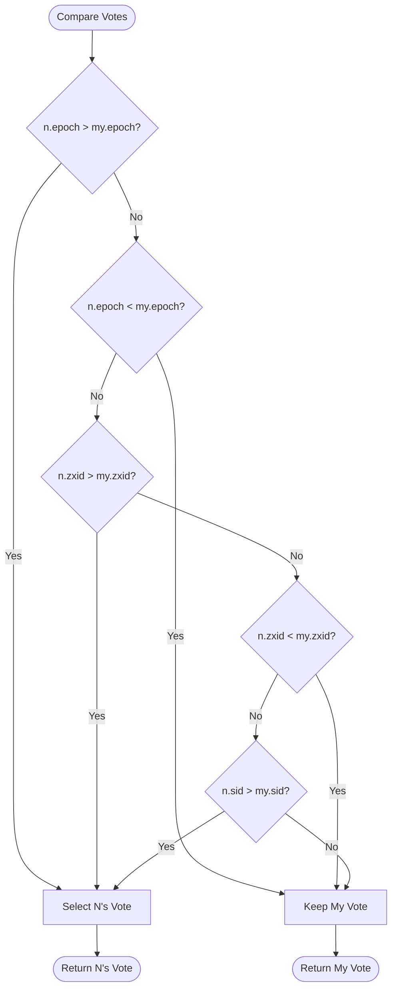

## 4. Distributed Lock Algorithm

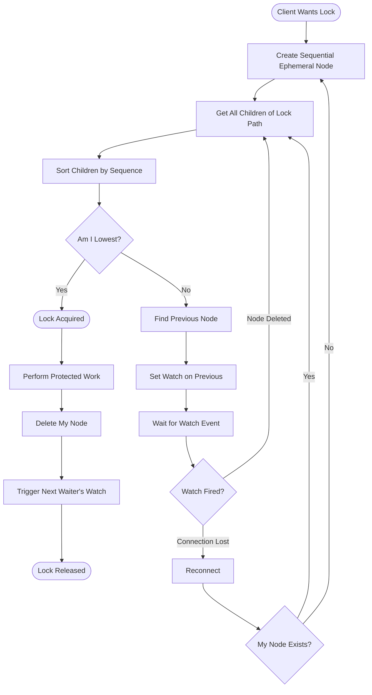

## 5. Two-Phase Commit (2PC) for Writes in Quorum Mode

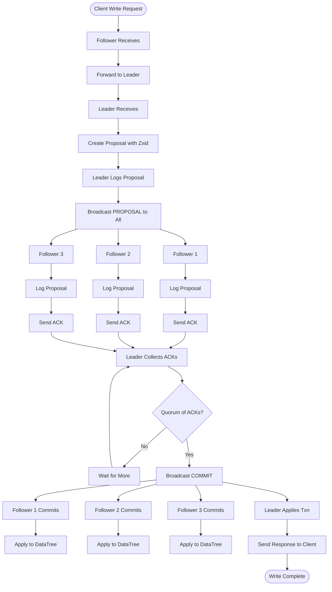

## 6. Watch Mechanism Flow

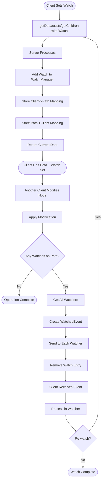

## 7. Session Lifecycle

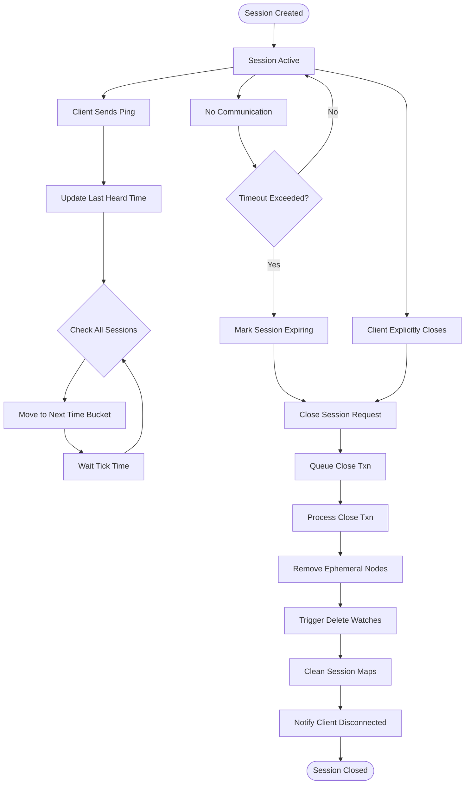

## 8. Barrier Implementation Flow

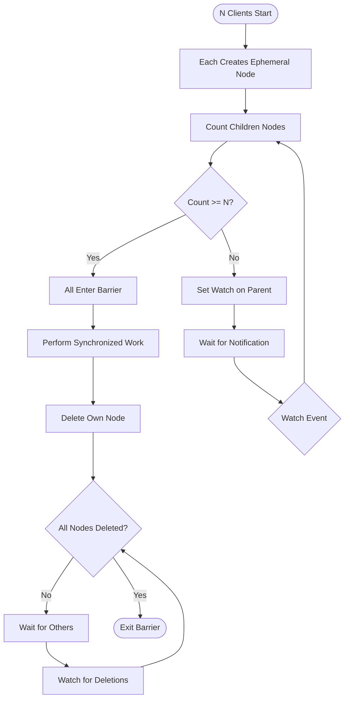

## 9. Request Processing Pipeline

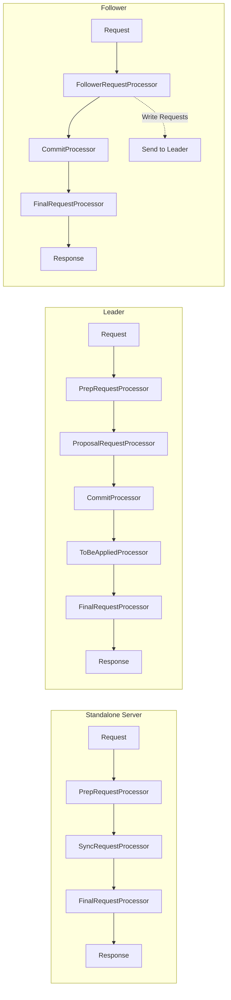

## 10. Quota Enforcement Flow

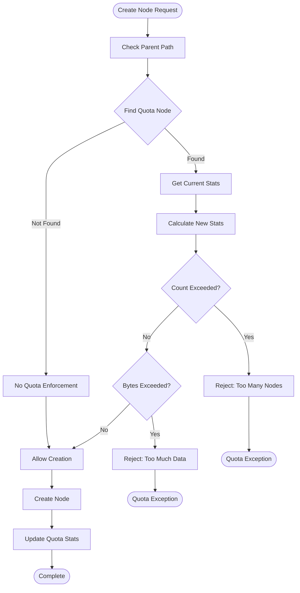

## Key Insights from Flowcharts

1. **Session Management is Continuous** - Heartbeats maintain liveness
2. **Leader Election is Deterministic** - Higher epoch/zxid/sid wins
3. **Writes are Coordinated** - 2PC ensures consistency across quorum
4. **Watches are One-Time** - Must re-register after trigger
5. **Locks are Fair** - Sequential ordering ensures FIFO
6. **Processing is Pipelined** - Different stages can work in parallel
7. **Failures are Handled** - Reconnection and session transfer built-in

These flowcharts represent the actual code flow in ZooKeeper's implementation and can be used to understand both the client-visible behavior and internal coordination mechanisms.