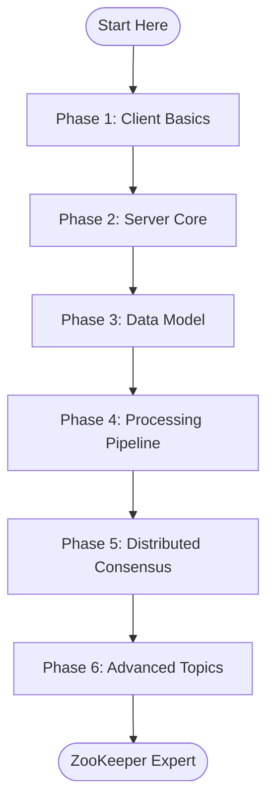

# ZooKeeper Codebase Learning Path

A structured approach to understanding Apache ZooKeeper's implementation, from basics to advanced topics.

## Prerequisites
- Java 8 knowledge
- Basic understanding of distributed systems
- Familiarity with client-server architecture

## Learning Path Overview



---

## Phase 1: Client-Side Basics (2-3 days)
*Start with the client to understand ZooKeeper's API and usage patterns*

### 1.1 Client API Entry Point
**Start here:** `zookeeper-server/src/main/java/org/apache/zookeeper/`

1. **ZooKeeper.java** (Main client class)
   - Constructor - how connections are established
   - Basic operations: create(), delete(), exists(), getData(), setData()
   - Async vs sync operations
   - Close and cleanup

2. **Watcher.java** (Event handling)
   - Watcher interface
   - WatchedEvent class
   - Event types and states

3. **CreateMode.java** (Node types)
   - PERSISTENT
   - EPHEMERAL
   - SEQUENTIAL variants

### 1.2 Client Connection Management
4. **ClientCnxn.java** (Connection handling)
   - Connection state management
   - Request/response handling
   - Event thread vs IO thread

5. **ClientCnxnSocket.java** (Abstract socket)
   - ClientCnxnSocketNIO.java (NIO implementation)
   - Packet serialization/deserialization

### 🔨 Practice Exercise 1
```java
// Write a simple client that:
// 1. Connects to ZooKeeper
// 2. Creates a node
// 3. Sets a watch
// 4. Updates the node
// 5. Receives watch notification
```

---

## Phase 2: Server Core (3-4 days)
*Understand how the server starts and handles requests*

### 2.1 Server Entry Points
**Location:** `zookeeper-server/src/main/java/org/apache/zookeeper/server/`

1. **ZooKeeperServerMain.java**
   - main() method - standalone mode entry
   - Configuration loading
   - Server initialization

2. **ZooKeeperServer.java**
   - Core server class
   - startup() - initialization sequence
   - processPacket() - request entry point
   - shutdown() - cleanup

### 2.2 Network Layer
3. **ServerCnxnFactory.java** (Abstract factory)
   - NIOServerCnxnFactory.java (NIO implementation)
   - NettyServerCnxnFactory.java (Netty implementation)

4. **ServerCnxn.java** (Abstract connection)
   - NIOServerCnxn.java - request reading
   - processPacket() - request dispatch

### 🔨 Practice Exercise 2
```bash
# Run ZooKeeper in standalone mode
# 1. Create a simple zoo.cfg
# 2. Start server with ZooKeeperServerMain
# 3. Connect with zkCli.sh
# 4. Debug through a create operation
```

---

## Phase 3: Data Model & Storage (3-4 days)
*Learn how ZooKeeper stores and manages data*

### 3.1 In-Memory Data Structure
**Location:** `zookeeper-server/src/main/java/org/apache/zookeeper/server/`

1. **DataTree.java** (Main data structure)
   - nodes (HashMap) - path to DataNode mapping
   - createNode() - node creation logic
   - deleteNode() - node deletion
   - setData() / getData() - data operations

2. **DataNode.java** (Individual node)
   - data[] - node content
   - stat - metadata
   - children - child names
   - acl - access control

3. **ZKDatabase.java** (Database wrapper)
   - DataTree management
   - Session tracking integration
   - Snapshot/restore functionality

### 3.2 Persistence Layer
**Location:** `zookeeper-server/src/main/java/org/apache/zookeeper/server/persistence/`

4. **FileTxnSnapLog.java** (Persistence coordinator)
   - Transaction log management
   - Snapshot management
   - Recovery logic

5. **FileTxnLog.java** (Transaction logging)
   - append() - log writes
   - Log file format
   - Recovery reading

6. **FileSnap.java** (Snapshots)
   - serialize() - create snapshot
   - deserialize() - load snapshot
   - Snapshot format

### 🔨 Practice Exercise 3
```java
// Explore data persistence:
// 1. Create nodes with data
// 2. Examine transaction logs in dataDir
// 3. Trigger a snapshot
// 4. Restart and observe recovery
```

---

## Phase 4: Request Processing Pipeline (4-5 days)
*Understand how requests flow through the system*

### 4.1 Request Processor Chain
**Location:** `zookeeper-server/src/main/java/org/apache/zookeeper/server/`

1. **RequestProcessor.java** (Interface)
   - processRequest()
   - shutdown()

2. **PrepRequestProcessor.java** (First stage)
   - Request validation
   - ACL checks
   - Transaction header creation
   - Path validation

3. **SyncRequestProcessor.java** (Logging stage)
   - Transaction logging
   - Batching for performance
   - Snapshot triggering

4. **FinalRequestProcessor.java** (Apply stage)
   - Apply to DataTree
   - Response generation
   - Watch triggering

### 4.2 Request Flow
5. **Request.java** (Request object)
   - Request types
   - Connection tracking
   - Transaction association

### 🔨 Practice Exercise 4
```java
// Trace a complete request:
// 1. Set breakpoints in each processor
// 2. Create a node from client
// 3. Follow the request through each stage
// 4. Observe transaction creation and logging
```

---

## Phase 5: Distributed Consensus (5-7 days)
*The heart of ZooKeeper - distributed coordination*

### 5.1 Quorum Basics
**Location:** `zookeeper-server/src/main/java/org/apache/zookeeper/server/quorum/`

1. **QuorumPeer.java** (Main quorum participant)
   - State machine (LOOKING, FOLLOWING, LEADING)
   - Main run loop
   - Role transitions

2. **QuorumPeerMain.java** (Entry point)
   - Quorum mode startup
   - Configuration parsing

### 5.2 Leader Election
3. **FastLeaderElection.java** (Election algorithm)
   - lookForLeader() - main election loop
   - totalOrderPredicate() - vote comparison
   - Notification handling

4. **Vote.java** (Vote structure)
   - leader - proposed leader
   - zxid - transaction id
   - epoch - election round

### 5.3 Leader-Follower Dynamics
5. **Leader.java** (Leader role)
   - lead() - main leader loop
   - propose() - proposal broadcast
   - processAck() - counting acknowledgments
   - commit() - committing transactions

6. **Follower.java** (Follower role)
   - followLeader() - main follower loop
   - processPacket() - handling leader messages
   - syncWithLeader() - initial sync

7. **LearnerHandler.java** (Leader side of follower)
   - Follower connection handling
   - Sync protocol
   - Proposal forwarding

### 5.4 Atomic Broadcast (ZAB)
8. **Proposal.java** (Proposal tracking)
   - Packet content
   - ACK counting
   - Commit handling

### 🔨 Practice Exercise 5
```bash
# Set up a 3-node cluster:
# 1. Configure 3 servers
# 2. Start them and observe election
# 3. Kill leader and watch re-election
# 4. Trace proposal flow for a write
```

---

## Phase 6: Advanced Topics (5-7 days)
*Deep dive into specialized areas*

### 6.1 Session Management
**Location:** `zookeeper-server/src/main/java/org/apache/zookeeper/server/`

1. **SessionTracker.java** (Interface)
   - SessionTrackerImpl.java - implementation
   - Session expiration
   - Ephemeral node cleanup

### 6.2 Watch Management
**Location:** `zookeeper-server/src/main/java/org/apache/zookeeper/server/watch/`

2. **WatchManager.java** (Watch tracking)
   - addWatch() - registration
   - triggerWatch() - notification
   - Path to watcher mappings

### 6.3 ACL and Security
3. **ACL subsystem**
   - ReferenceCountedACLCache.java
   - Authentication providers
   - Authorization logic

### 6.4 Quota Management
4. **Quota system**
   - Quota nodes in /zookeeper/quota
   - Enforcement in PrepRequestProcessor

### 6.5 Multi-Operation Support
5. **MultiTransactionRecord.java**
   - Atomic multi-operation
   - Rollback on failure

---

## Debugging Tips

### Essential Debug Points
```java
// Client side
ZooKeeper.<init>           // Connection start
ClientCnxn.submitRequest() // Request sending
ClientCnxn.readResponse()  // Response handling

// Server side
NIOServerCnxn.doIO()       // Request receiving
PrepRequestProcessor.run() // Processing start
DataTree.createNode()      // State change
FinalRequestProcessor.processRequest() // Response sending

// Quorum
FastLeaderElection.lookForLeader() // Election
Leader.propose()           // Proposal creation
Follower.processPacket()   // Follower processing
```

### Logging Configuration
```xml
<!-- conf/logback.xml -->
<logger name="org.apache.zookeeper" level="DEBUG"/>
<logger name="org.apache.zookeeper.server.quorum" level="TRACE"/>
```

---

## Project Structure Reference

```
zookeeper/
├── zookeeper-server/          # Main server + client code
│   ├── src/main/java/
│   │   └── org/apache/zookeeper/
│   │       ├── [client classes]      # Phase 1
│   │       └── server/
│   │           ├── [core server]     # Phase 2
│   │           ├── [data model]      # Phase 3
│   │           ├── [processors]      # Phase 4
│   │           ├── quorum/          # Phase 5
│   │           ├── persistence/     # Phase 3
│   │           └── watch/          # Phase 6
│   └── src/test/              # Unit tests - great for learning!
├── zookeeper-jute/           # Serialization framework
├── zookeeper-recipes/        # Higher-level primitives
└── zookeeper-docs/           # Documentation

```

---

## Recommended Learning Resources

### Code Reading Order
1. **Week 1-2**: Client API and basic server
2. **Week 3**: Data model and storage
3. **Week 4**: Request processing
4. **Week 5-6**: Distributed consensus
5. **Week 7+**: Advanced topics

### Key Papers
1. "ZooKeeper: Wait-free coordination for Internet-scale systems"
2. "A simple totally ordered broadcast protocol" (ZAB)

### Test Files to Study
- `ZooKeeperTest.java` - Client operations
- `DataTreeTest.java` - Data structure  
- `FileTxnLogTest.java` - Persistence
- `FLETest.java` - Leader election
- `QuorumPeerMainTest.java` - Cluster setup

### Community Resources
- ZooKeeper mailing lists
- JIRA for understanding bug fixes
- GitHub PRs for recent changes

---

## Hands-On Exercises

### Exercise 1: Client Mastery
Build a distributed configuration service using ZooKeeper client API.

### Exercise 2: Custom Request Processor
Add a custom RequestProcessor that logs all operations.

### Exercise 3: Watch Analysis
Create a tool to visualize all active watches in a running system.

### Exercise 4: Election Observer
Build a monitoring tool that shows leader election in real-time.

### Exercise 5: Performance Analysis
Profile ZooKeeper under load and identify bottlenecks.

---

## Common Pitfalls to Avoid

1. **Starting with quorum code** - Too complex initially
2. **Ignoring tests** - Tests show intended usage
3. **Skipping serialization** - Jute is fundamental
4. **Not running code** - Debugging is essential
5. **Reading without context** - Follow data flow

---

## Certification Checklist

- [ ] Can explain client connection lifecycle
- [ ] Understand all node types and their uses
- [ ] Can trace a write request end-to-end
- [ ] Understand leader election algorithm
- [ ] Can explain 2-phase commit in ZAB
- [ ] Know session expiration mechanism
- [ ] Can implement custom recipes
- [ ] Understand performance characteristics

---

## Next Steps

After completing this learning path:
1. Contribute to ZooKeeper (start with documentation/tests)
2. Build production systems using ZooKeeper
3. Explore similar systems (etcd, Consul)
4. Deep dive into Raft/Paxos algorithms

Remember: The key to understanding ZooKeeper is to **run it, debug it, and modify it**. Reading alone isn't enough!